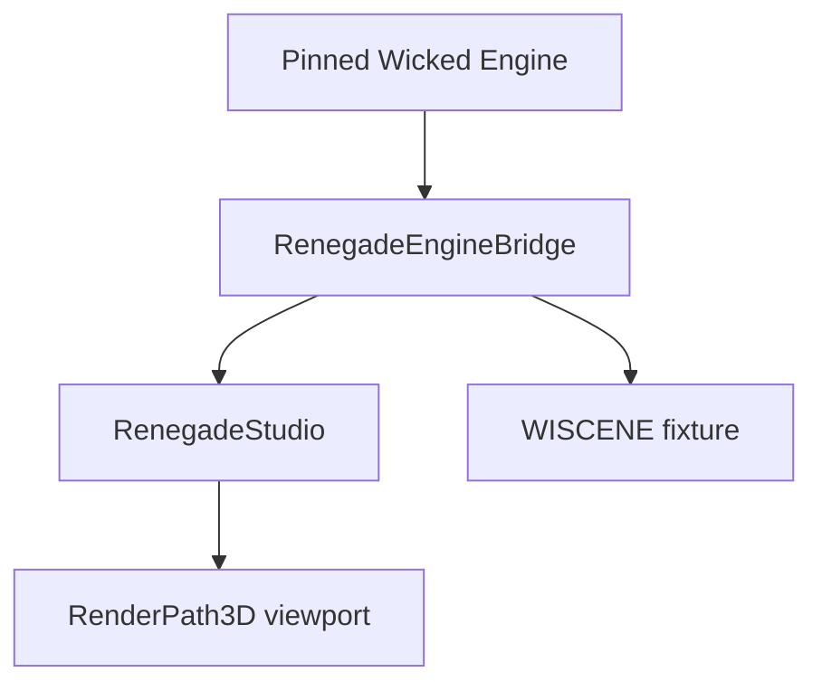

# Phase 2 Studio Shell

## Outcome

This increment establishes the first Renegade-owned application boundary above
the pinned Wicked foundation:



`RenegadeStudio` owns the Win32 shell and lifecycle. `EngineBridge` owns scene
and selection state. Wicked remains the renderer, ECS, serializer, input layer,
and runtime foundation.

## Included

- Root Renegade CMake graph.
- Static `RenegadeEngineBridge` target.
- `SceneService`, `SelectionService`, and `StudioSession`.
- Windows `RenegadeStudio` target with per-monitor DPI awareness.
- Real `RenderPath3D` viewport.
- Transactional load of a packaged `cube.wiscene` fixture.
- Embedded Wicked shader option for a predictable first package.
- Debug/Release build script, evidence JSON, hashes, logs, ZIP packages, and CI.

## Deliberately excluded

- Production docking or panel framework.
- Hierarchy and inspector panels.
- Gizmos, commands, undo/redo, save, and reopen.
- Runtime player target.
- Final UI toolkit selection.

The diagnostic status label does not resolve ADR 0002. It exists only to make
scene-load state visible in the proof.

## Build

From a Visual Studio Developer PowerShell:

```powershell
git submodule update --init --recursive
.\Tools\Build-Studio-Windows.ps1 -Clean
```

The default evidence directory is `artifacts/phase2/studio-<timestamp>`.
Successful builds produce Debug and Release packages and a `build-result.json`
whose status is `PASS`.

## Acceptance evidence

Automated:

- Pinned Wicked commit is exact and unmodified.
- Renegade CMake configures.
- `RenegadeStudio` builds for Windows x64 Debug and Release.
- The package contains `RenegadeStudio.exe`, `dxcompiler.dll`, and
  `Content/cube.wiscene`.
- Output hashes and build logs are captured.

Human-observed:

- The window title reads `Renegade Studio — Phase 2`.
- The viewport renders the known scene without a shader or asset error.
- Resize and Windows DPI changes leave the viewport usable.
- Keyboard and mouse input continue to reach the application.

Independent review:

- A different AI or human reviews the exact commit.
- The reviewer confirms Studio does not own a duplicate scene model.
- The reviewer confirms the temporary label is not treated as a toolkit
  decision.

## Next bounded increment

Add a Runtime shell and the smallest useful editor interaction: hierarchy
listing, selected entity, transform inspector, and one undoable transform
command. Save/reopen and the UI-toolkit decision remain separate acceptance
gates.
